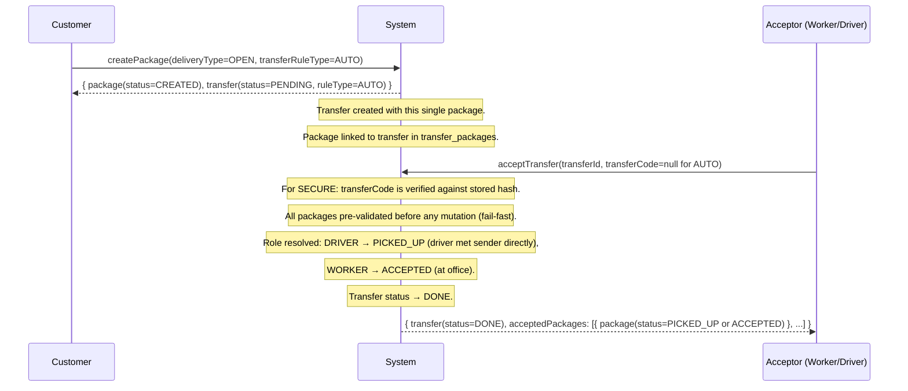
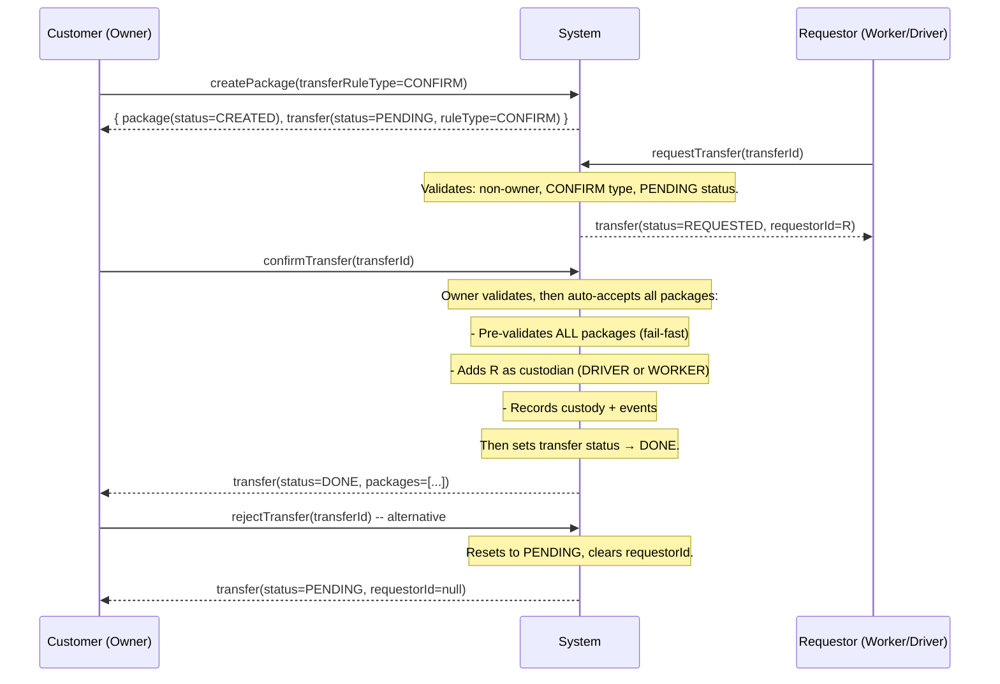
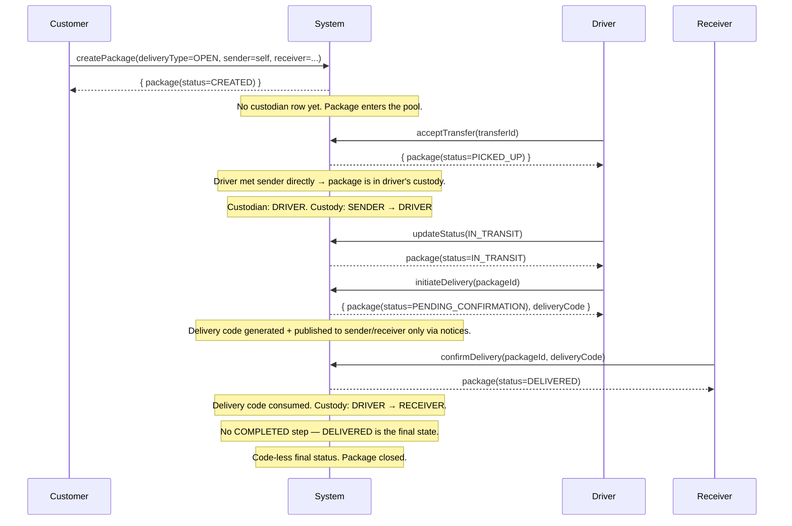
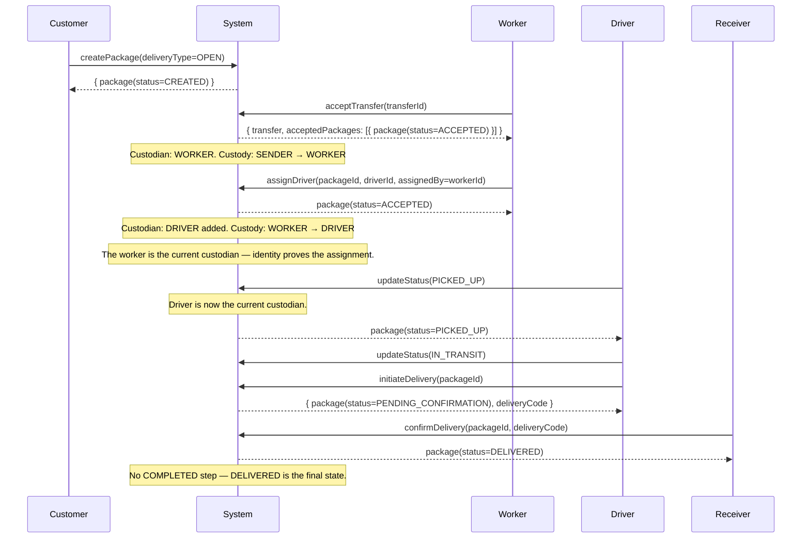
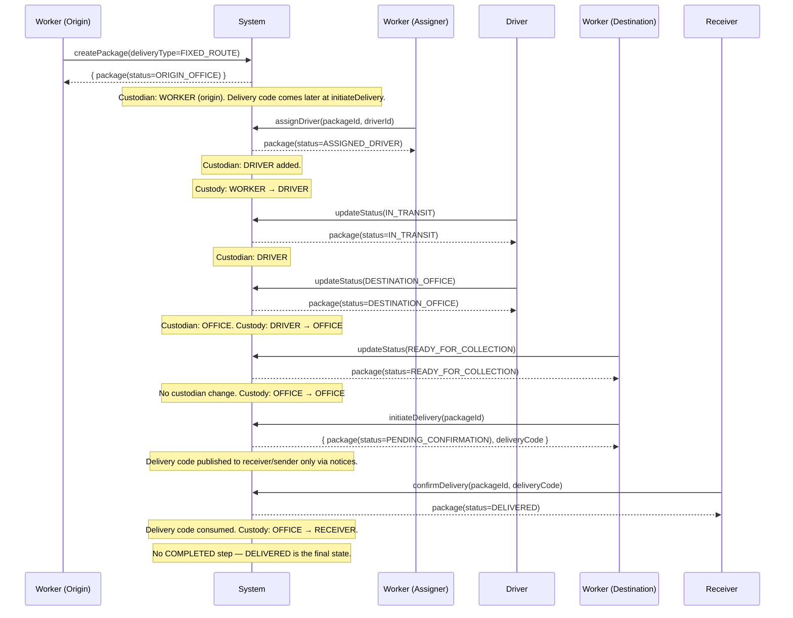
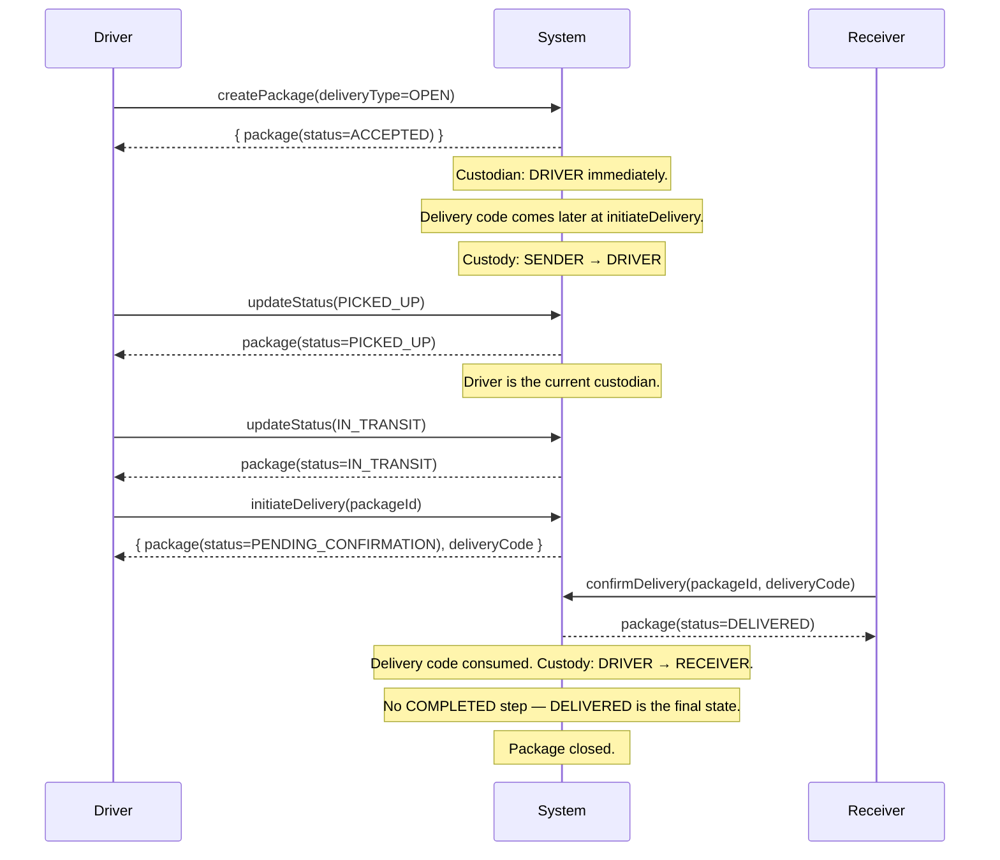
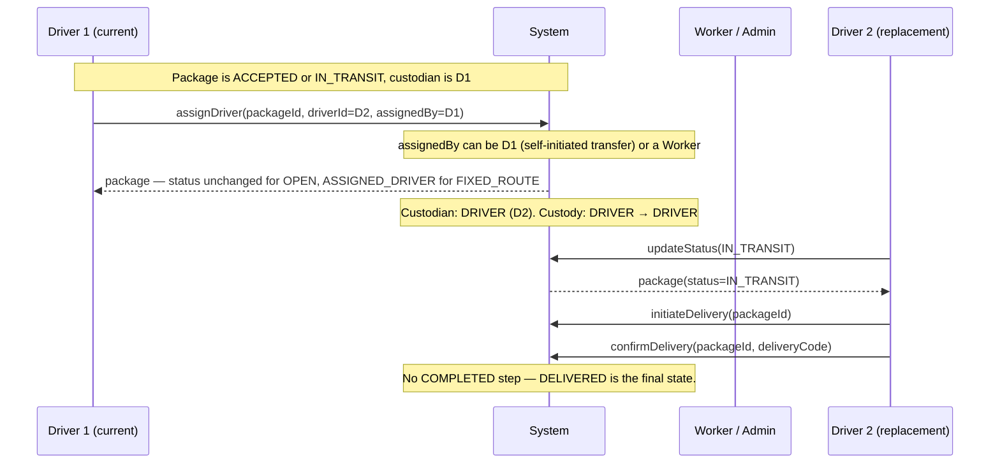
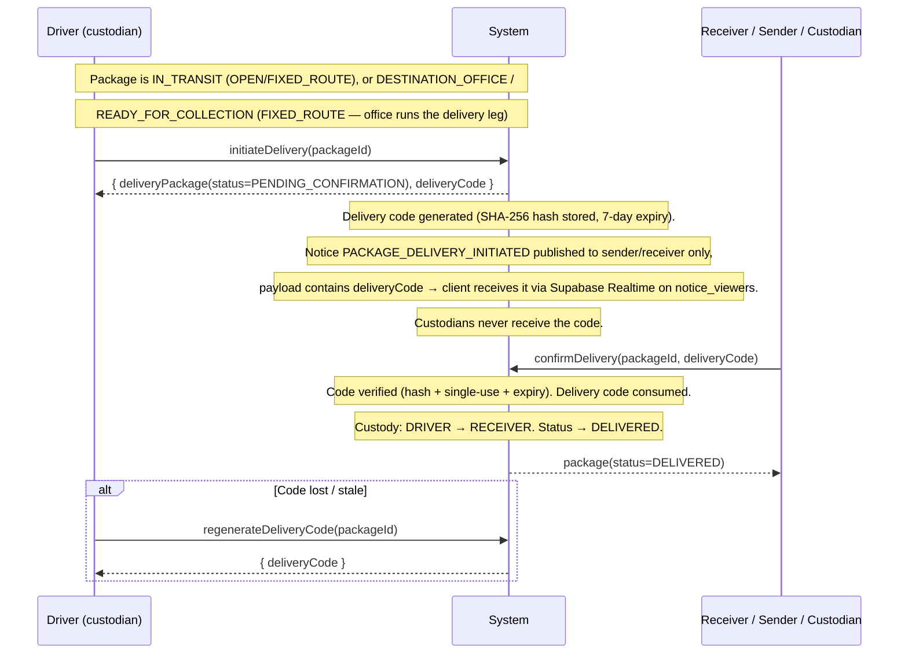
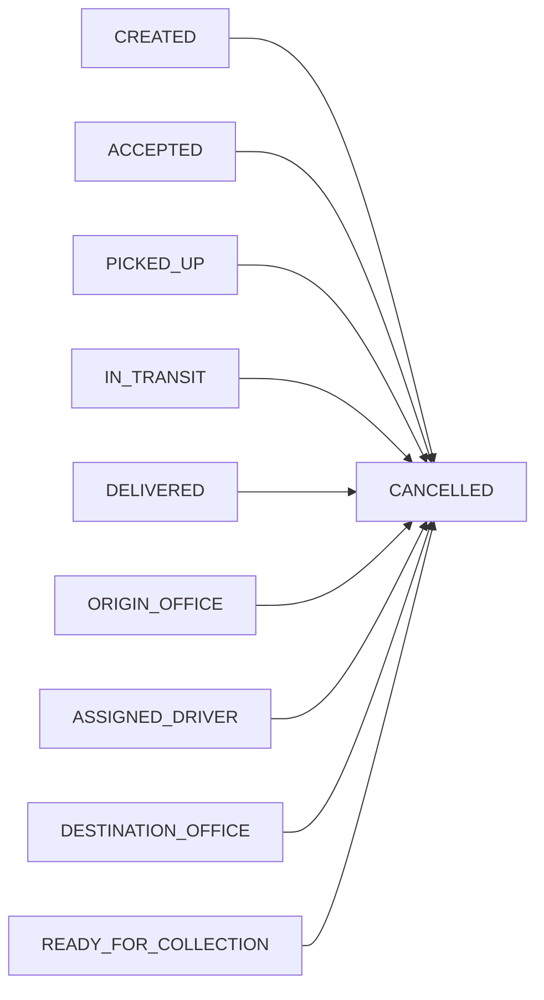

# Package Lifecycle — Complete Flow Reference

This document covers every possible path a package can take through the CavGo delivery system, from creation to completion or cancellation. It covers both delivery types, all actor roles, registered and unregistered senders/receivers, and every custody transfer that occurs along the way.

> **Recent behavior changes (aligns docs with code):**
> - **`DELIVERED` is terminal.** Confirming the delivery *is* the completion — there is no separate
>   `COMPLETED` step anymore and no `updatePackageStatus(COMPLETED)` call. `COMPLETED` survives in the
>   enum only for legacy rows.
> - **Driver accepting from the sender directly holds the package.** Accepting a `CREATED` package
>   (OPEN **or** FIXED_ROUTE) as a DRIVER now lands in `PICKED_UP` (not `ORIGIN_OFFICE`) — the driver
>   can go straight to delivering or transferring to an office.
> - **Office-received packages are deliverable by office staff.** When a driver hands off at the
>   destination office the custody row is role `OFFICE`; any WORKER/ADMIN/SUPER_ADMIN can see such
>   packages (`myPackages`) and run `initiateDelivery` / `confirmDelivery` (staff bypass), and
>   `initiateDelivery` is also valid straight from `DESTINATION_OFFICE`.
> - Cancellation rules are unchanged (out of scope for now).

---

## Table of Contents

1. [Core Concepts](#1-core-concepts)
2. [Actors and Their Permissions](#2-actors-and-their-permissions)
3. [Package Anatomy](#3-package-anatomy)
4. [Delivery Types](#4-delivery-types)
5. [Transfer System](#5-transfer-system)
6. [Flow F — Package Created with Transfer (AUTO / SECURE)](#6-flow-f--package-created-with-transfer-auto--secure)
7. [Flow G — Package Created with Transfer (CONFIRM)](#7-flow-g--package-created-with-transfer-confirm)
8. [Flow A — Customer Creates, Open Delivery (Direct Driver)](#8-flow-a--customer-creates-open-delivery-direct-driver)
9. [Flow B — Customer Creates, Open Delivery (Worker Accepts First)](#9-flow-b--customer-creates-open-delivery-worker-accepts-first)
10. [Flow C — Worker Creates, Fixed-Route (Office to Office)](#10-flow-c--worker-creates-fixed-route-office-to-office)
11. [Flow D — Driver Creates (Self-Delivery)](#11-flow-d--driver-creates-self-delivery)
12. [Flow E — Driver-to-Driver Transfer](#12-flow-e--driver-to-driver-transfer)
13. [Flow H — Delivery Initiation & Confirmation](#125-flow-h--delivery-initiation--confirmation-delivery-code)
14. [Cancellation — Any Stage](#14-cancellation--any-stage)
15. [Registered vs Unregistered Sender/Receiver](#15-registered-vs-unregistered-senderreceiver)
16. [Tokens and Codes Reference](#16-tokens-and-codes-reference)
17. [Custody Chain Reference](#17-custody-chain-reference)
18. [Status Transition Tables](#18-status-transition-tables)
19. [API Operations Quick Reference](#19-api-operations-quick-reference)

---

## 1. Core Concepts

### Delivery Type
Every package is created as one of two types, chosen at creation time and fixed thereafter:

| Type | Description |
|---|---|
| `OPEN` | Flexible point-to-point delivery. A driver picks up directly from the sender and delivers to the receiver. |
| `FIXED_ROUTE` | Office-to-office delivery. The package travels through origin and destination offices, handed off between workers and drivers along the way. |

### Custodians vs People vs Creator

| Concept | Where stored | What it means |
|---|---|---|
| **Creator** | `packages.creator_id` | The registered user who called `createPackage`. Never a custodian unless they are also a WORKER or DRIVER. |
| **Custodian** | `package_custodians` table | A WORKER, DRIVER, or OFFICE currently or previously responsible for the physical package. CUSTOMER is never a custodian. |
| **People** | `package_people` table | The SENDER and RECEIVER. May be registered users (with a `userId`) or anonymous (name + phone only). Not custodians. |

### Custody Proof (identity-based)
Custody transfers are proven by **who** the actor is, not by a secret. Status transitions and driver assignment require the actor to be the **current custodian** (the most recent row in `package_custodians`) — or trusted office staff (WORKER/ADMIN/SUPER_ADMIN) acting on the office's behalf. The one-time handover token was removed; the custodian table is the single source of truth for who holds the package.

### Delivery Code
A 6-digit numeric code generated when delivery is **initiated** (`initiateDelivery` mutation, status → `PENDING_CONFIRMATION`). It is published **only to the sender and receiver** via the notice feed (payload field `deliveryCode`) — never to custodians — and presented in `confirmDelivery` to set the package to `DELIVERED`. Regenerable while status is `PENDING_CONFIRMATION`. Replaces the old pickup code (removed).

---

## 2. Actors and Their Permissions

| Role | Can Create | Can Accept | Can Assign Driver | Can Update Status | Is a Custodian |
|---|---|---|---|---|---|
| `CUSTOMER` | Yes | No | No | No | Never |
| `WORKER` | Yes | Yes | Yes | Yes | Yes (WORKER) |
| `DRIVER` | Yes | Yes | Yes (self or transfer) | Yes | Yes (DRIVER) |
| `ADMIN` | No | No | Yes | No | No |
| `SUPER_ADMIN` | No | No | Yes | No | No |

**Driver constraint:** A driver must have an active account (`UserStatus.ACTIVE`) and their driver profile must be in `DriverStatus.ONLINE` to be assigned to or accept a package.

---

## 3. Package Anatomy

When a package is created the following records are written:

```
packages                   — the package itself (status, deliveryType, creatorId, companyId, ...)
package_people             — sender and receiver (name, phone, optional userId)
package_locations          — origin and destination coordinates / place info
package_details            — optional weight, dimensions, category, etc.
delivery_codes             — 6-digit delivery-confirmation code (created at initiateDelivery, regenerable while PENDING_CONFIRMATION)
package_custodians         — append-only log of who has held custody and in what role
package_custody            — append-only log of every custody transfer (from → to)
package_events             — append-only audit timeline of every action
```

---

## 4. Delivery Types

### OPEN — State Machine

```
                   ┌─────────────────────────────────────────────────────────────────┐
                   │                                                                 │
                   │  Worker accepts from sender                                     │
                   ▼                                                                 │
              ACCEPTED ─────────────────────────────────────────────────────────────┐ │
                   │                                                                 │ │
CREATED ──►       │  Driver accepts from sender directly                            │ │
   │              ▼                                                                 │ │
   └──────► PICKED_UP ──► IN_TRANSIT ──► PENDING_CONFIRMATION ──► DELIVERED
              │              │                │              │
              └──────────────┴────────────────┴──────────────┴──► CANCELLED
```

**Key:** When a **driver** accepts from a sender directly, the package goes straight to `PICKED_UP` (driver already has the package). When a **worker** accepts, it goes to `ACCEPTED` (at office, needs driver assignment). **`DELIVERED` is terminal** — confirmation is the final step.

### FIXED_ROUTE — State Machine

```
                                              ┌──────────────────────────────────────────┐
                                              │ (driver delivers directly to receiver)    │
                                              ▼                                          │
CREATED ──► ORIGIN_OFFICE ──► ASSIGNED_DRIVER ──► IN_TRANSIT ──► DESTINATION_OFFICE ──► READY_FOR_COLLECTION ──► PENDING_CONFIRMATION ──► DELIVERED
   │               │                  │                │                   │                       │                       │             │
   │               └────► PICKED_UP ───┘                │                   │                       │                       │             │
   │                (driver accepts from sender)        │                   │                       │                       │             │
   └────────────────────────────────────────────────────┴───────────────────┴───────────────────────┴───────────────────────┴─────────────┴───────────────► CANCELLED
```

**Key:** A **driver** accepting from the sender directly on a FIXED_ROUTE package goes to `PICKED_UP` — the driver already holds it, so they may deliver straight to the receiver (`initiateDelivery`) or continue through `IN_TRANSIT` / `DESTINATION_OFFICE`. A **worker** accepting brings it to `ORIGIN_OFFICE` for driver assignment. **`DELIVERED` is terminal** — confirmation is the final step.

---

## 5. Transfer System

A transfer groups one or more packages together for coordinated handover to a driver or worker. Instead of accepting individual packages, a worker/driver accepts the entire transfer at once.

### Transfer Rules

| Rule Type | Behavior |
|---|---|
| `AUTO` | Direct acceptance — anyone can call `acceptTransfer` without a code. |
| `SECURE` | Code-protected — the caller must provide the 8-character transfer code, which is verified against a SHA-256 hash. The code is returned once on creation and can be regenerated by the owner. |
| `CONFIRM` | Two-step handshake — a user requests the transfer via `requestTransfer`, then the owner explicitly confirms via `confirmTransfer`. On confirmation, all packages are auto-accepted (the requestor becomes custodian). No code needed. |

### Transfer Statuses

| Status | Description |
|---|---|
| `PENDING` | Transfer is open and active. Packages can be accepted (AUTO/SECURE) or requested (CONFIRM). |
| `REQUESTED` | A user has requested this CONFIRM transfer. Waiting for the owner to confirm or reject. |
| `DONE` | Transfer completed — all packages accepted. |
| `CANCELED` | Transfer cancelled by the owner. |

### Transfer Ownership
- The **creator** of a transfer is the **owner**.
- Only the owner can: add packages, change the rule type, regenerate SECURE codes, cancel, or confirm/reject CONFIRM requests.
- Any authenticated user can complete an AUTO/SECURE transfer via `acceptTransfer`.
- Any authenticated user (except the owner) can request a CONFIRM transfer via `requestTransfer`.

### Package Uniqueness
- A package can belong to at most one open (`PENDING`) transfer at a time.
- If a package is in another open transfer owned by the **same user**, it is moved to the new transfer.
- If owned by a **different user**, the operation is rejected.
- Completed (`DONE`) or cancelled (`CANCELED`) transfers free their packages for new transfers.

### Creating a Transfer with a Package

A transfer can be created in two ways:
1. **Inline at package creation** — pass `transferRuleType` in `CreatePackageInput`. A transfer is auto-created containing just the new package.
2. **Standalone** — call `createTransfer` mutation directly with one or more existing packages.

---

## 6. Flow F — Package Created with Transfer (AUTO / SECURE)

**Scenario:** A customer creates a package with an AUTO or SECURE transfer. A driver/worker accepts the entire transfer by ID (+ code for SECURE), becoming custodian of all packages.



### Step-by-step

| Step | Who | Action | Transfer Status | Package Status | Custodian |
|---|---|---|---|---|---|
| 1 | Customer | `createPackage(transferRuleType=AUTO)` | `PENDING` | `CREATED` | _(none)_ |
| 2 | Driver | `acceptTransfer(transferId)` | `DONE` | `PICKED_UP` | DRIVER |
| 2 | Worker | `acceptTransfer(transferId)` | `DONE` | `ACCEPTED` | WORKER |
| 3 | Driver | Continue normal flow (`IN_TRANSIT` → ... → `DELIVERED`) | — | onwards | DRIVER |

---

## 7. Flow G — Package Created with Transfer (CONFIRM)

**Scenario:** A customer creates a package with a CONFIRM transfer. A driver/worker requests the transfer. The owner confirms, which auto-accepts all packages.



### Step-by-step (accept flow)

| Step | Who | Action | Transfer Status | Package Status |
|---|---|---|---|---|
| 1 | Owner | `createPackage(transferRuleType=CONFIRM)` | `PENDING` | `CREATED` |
| 2 | Worker/Driver | `requestTransfer(transferId)` | `REQUESTED` | `CREATED` |
| 3 | Owner | `confirmTransfer(transferId)` | `DONE` | `ACCEPTED` (auto) |

### Step-by-step (reject flow)

| Step | Who | Action | Transfer Status |
|---|---|---|---|
| 1 | Owner | `createPackage(transferRuleType=CONFIRM)` | `PENDING` |
| 2 | Worker/Driver | `requestTransfer(transferId)` | `REQUESTED` |
| 3 | Owner | `rejectTransfer(transferId)` | `PENDING` (cleared requestor) |

---

## 8. Flow A — Customer Creates, Open Delivery (Direct Driver)

**Scenario:** A registered or unregistered customer wants a package picked up directly by a driver. A driver sees the open offer and accepts it.



### Step-by-step

| Step | Who | Action | Status after | Custodian after | Code |
|---|---|---|---|---|---|
| 1 | Customer | `createPackage` | `CREATED` | _(none)_ | — |
| 2 | Driver | **`acceptTransfer`** | `PICKED_UP` | DRIVER | — |
| 3 | Driver | `updateStatus(IN_TRANSIT)` | `IN_TRANSIT` | DRIVER | — |
| 4 | Driver | `initiateDelivery` | `PENDING_CONFIRMATION` | DRIVER | Delivery code generated + published |
| 5 | Sender/Receiver | `confirmDelivery` + delivery code | `DELIVERED` | _(no new custodian)_ | Delivery code consumed |


> **Note on acceptance:** When a driver accepts from a sender directly (OPEN delivery), the package goes straight to `PICKED_UP` because the driver already has the package. The driver does not need to manually mark it as picked up. See [Flow F](#6-flow-f--package-created-with-transfer-auto--secure) for AUTO/SECURE and [Flow G](#7-flow-g--package-created-with-transfer-confirm) for CONFIRM flows.

**Who has the delivery code?**
The driver initiates delivery (`initiateDelivery`), and the code is published to the sender/receiver only through their notice feed. Any of the sender or receiver can submit it in `confirmDelivery`.

---

## 9. Flow B — Customer Creates, Open Delivery (Worker Accepts First)

**Scenario:** A customer creates a package. A worker at the office accepts it on behalf of the company, then assigns a driver.



### Step-by-step

| Step | Who | Action | Status after | Custodian after |
|---|---|---|---|---|
| 1 | Customer | `createPackage` | `CREATED` | _(none)_ |
| 2 | Worker | `acceptTransfer` | `ACCEPTED` | WORKER |
| 3 | Worker | `assignDriver` | `ACCEPTED` | DRIVER |
| 4 | Driver | `updateStatus(PICKED_UP)` | `PICKED_UP` | DRIVER |
| 5 | Driver | `updateStatus(IN_TRANSIT)` | `IN_TRANSIT` | DRIVER |
| 6 | Driver | `initiateDelivery` | `PENDING_CONFIRMATION` | DRIVER |
| 7 | Sender/Receiver/Custodian | `confirmDelivery` + delivery code | `DELIVERED` | _(no new custodian)_ |


---

## 10. Flow C — Worker Creates, Fixed-Route (Office to Office)

**Scenario:** A worker at the origin office receives a package from a customer (registered or walk-in). They log it in the system. It travels to a destination office, where another worker or the receiver collects it.



### Step-by-step

| Step | Who | Action | Status after | Custodian after |
|---|---|---|---|---|
| 1 | Worker | `createPackage(FIXED_ROUTE)` | `ORIGIN_OFFICE` | WORKER |
| 2 | Worker/Admin | `assignDriver` | `ASSIGNED_DRIVER` | DRIVER |
| 3 | Driver | `updateStatus(IN_TRANSIT)` | `IN_TRANSIT` | DRIVER |
| 4 | Driver | `updateStatus(DESTINATION_OFFICE)` | `DESTINATION_OFFICE` | OFFICE |
| 5 | Worker | `updateStatus(READY_FOR_COLLECTION)` | `READY_FOR_COLLECTION` | _(no change)_ |
| 6 | Worker | `initiateDelivery` | `PENDING_CONFIRMATION` | _(no change)_ |
| 7 | Receiver/Sender/Custodian | `confirmDelivery` + delivery code | `DELIVERED` | _(no change)_ |


---

## 11. Flow D — Driver Creates (Self-Delivery)

**Scenario:** A driver is at the sender's location and creates the package themselves — they immediately own custody and begin the delivery without any worker involvement.



### Step-by-step

| Step | Who | Action | Status after | Custodian after | Code |
|---|---|---|---|---|---|
| 1 | Driver | `createPackage` | `ACCEPTED` | DRIVER | — |
| 2 | Driver | `updateStatus(PICKED_UP)` | `PICKED_UP` | DRIVER | — |
| 3 | Driver | `updateStatus(IN_TRANSIT)` | `IN_TRANSIT` | DRIVER | — |
| 4 | Driver | `initiateDelivery` | `PENDING_CONFIRMATION` | DRIVER | Delivery code generated + published |
| 5 | Sender/Receiver/Custodian | `confirmDelivery` + delivery code | `DELIVERED` | _(no new custodian)_ | Delivery code consumed |


**Key difference from Flow A:** In Flow A the driver calls `acceptTransfer` to accept the package. Here the driver is the creator, so the package is auto-accepted at `createPackage`. In both flows the delivery code is only generated later at `initiateDelivery`.

---

## 12. Flow E — Driver-to-Driver Transfer

**Scenario:** A driver has a package in-flight but cannot complete the delivery (end of shift, out-of-area). The package is transferred to another driver. This can be initiated by the current driver themselves or by a worker/admin.



### Step-by-step

| Step | Who | Action | Notes |
|---|---|---|---|
| 1 | Driver 1 or Worker | `assignDriver(driverId=D2, assignedBy=D1)` | `assignedBy` must be the current custodian (Driver 1) or trusted office staff (WORKER/ADMIN/SUPER_ADMIN). |
| 2 | Driver 2 | Continues normal delivery flow | D2 is now the active custodian |

**Constraints:**
- The assigner must be the current custodian or trusted office staff — the custodian table proves the handoff.
- Driver 2 must be `ONLINE` at the time of assignment.
- Cannot assign to a COMPLETED or CANCELLED package.

---

## 12.5 Flow H — Delivery Initiation & Confirmation (Delivery Code)

**Scenario:** The driver reaches the destination but delivery is only confirmed once the recipient (or sender / initiating custodian) verifies a one-time code. This replaces the old pickup-code-at-COMPLETED step.



### Step-by-step

| Step | Who | Action | Status after | Custody record |
|---|---|---|---|---|
| 1 | Driver | `initiateDelivery(packageId)` | `PENDING_CONFIRMATION` | current → current ("awaiting confirmation") |
| 2 | Sender/Receiver/Custodian | `confirmDelivery(packageId, deliveryCode)` | `DELIVERED` | DRIVER → RECEIVER |
| 2b (alt) | Driver | `regenerateDeliveryCode(packageId)` | `PENDING_CONFIRMATION` (unchanged) | — |

**Constraints:**
- `initiateDelivery` requires the current custodian (active WORKER/DRIVER) **or** trusted office staff (WORKER/ADMIN/SUPER_ADMIN) acting for the office. Valid from `IN_TRANSIT` (OPEN/FIXED_ROUTE) or `DESTINATION_OFFICE` / `READY_FOR_COLLECTION` (FIXED_ROUTE).
- `confirmDelivery` requires authentication and the caller must be the **sender**, **receiver**, **current custodian**, or trusted office staff. The code must match, be unused, and be unexpired.
- `regenerateDeliveryCode` only while status is `PENDING_CONFIRMATION`; the previous code is invalidated.
- `updatePackageStatus` cannot set `PENDING_CONFIRMATION` or `DELIVERED` directly — those statuses require the dedicated mutations. `COMPLETED` is no longer a valid target: **`DELIVERED` is terminal.**

---

## 14. Cancellation — Any Stage

Cancellation is valid from any non-terminal status (i.e. any status that is not already `COMPLETED` or `CANCELLED`).



### What happens on cancellation

| State | Custody record written |
|---|---|
| Before any custodian (e.g. CUSTOMER-created, not yet accepted) | `SENDER → CANCELLED` |
| Has a custodian | `<current custodian role> → CANCELLED` |

No new custodian is added. The package is closed. No codes are regenerated.

**Who can cancel?** Same rule as every status transition: the **current custodian** or trusted office staff (WORKER/ADMIN/SUPER_ADMIN). A customer-created `CREATED` package has no custodian yet, so only office staff can cancel it before it is accepted.

---

## 15. Registered vs Unregistered Sender/Receiver

The system supports both registered users and anonymous walk-in clients for the sender and receiver. The `package_people` table holds them both.

### Sender

| Scenario | How it works |
|---|---|
| **CUSTOMER creating, no sender provided** | System auto-fills from the authenticated user's profile (`firstName + lastName`, `phone`). The `userId` is set to the creator's ID. |
| **CUSTOMER creating, sender explicitly provided with userId** | System enriches with profile data (fills missing `name` or `phone` from the user record). |
| **CUSTOMER creating, sender provided with name + phone only (no userId)** | Stored as anonymous. No user lookup. `userId` is null. |
| **WORKER or DRIVER creating** | Must provide sender explicitly. If `userId` is given, profile is looked up. If not, name + phone are stored as-is. |

### Receiver

| Scenario | How it works |
|---|---|
| **Registered user (userId provided)** | System enriches: if `name` or `phone` are missing, they are filled from the user's profile. |
| **Unregistered / walk-in (no userId)** | Name and phone stored exactly as provided. `userId` is null. No account needed. |

### Tracking packages for unregistered receivers

An unregistered receiver cannot log in to see their package. They can only track by:
- Calling `packageByTrackingCode(code)` — no authentication required.
- Being told the tracking code by the sender.

A registered receiver can call `myPackages` — the system searches `package_people` by both `userId` and `phone` to find packages they are associated with.

---

## 16. Tokens and Codes Reference

### Custody Proof (identity-based)

| Property | Detail |
|---|---|
| **What proves custody** | The most recent `package_custodians` row (`findTopByPackageIdOrderByAssignedAtDesc`) |
| **Who can advance status / assign a driver** | The current custodian, or trusted office staff (WORKER/ADMIN/SUPER_ADMIN) |
| **Enforced at** | `updatePackageStatus` (all transitions) and `assignDriver` |
| **Purpose** | Replaces the old one-time handover token — no secrets to carry or rotate |

### Delivery Code

| Property | Detail |
|---|---|
| **Format** | 6-digit numeric string |
| **When issued** | At `initiateDelivery` (transition to `PENDING_CONFIRMATION`), or via `regenerateDeliveryCode` while `PENDING_CONFIRMATION` |
| **Who receives it** | Published to the notice feed of the package's sender and receiver only (payload field `deliveryCode`) — custodians never receive the code |
| **When consumed** | At `confirmDelivery` — marks the package `DELIVERED` |
| **One-time use** | Yes |
| **Expiry** | 7 days from generation (enforced in `verifyDeliveryCode`) |
| **Purpose** | Confirms the receiver (or sender / initiating custodian) actually received the delivery |

> **Note:** The old 6-digit **pickup code** (generated at accept time, required for `COMPLETED`) has been removed, and the separate `COMPLETED` step is gone too. Delivery confirmation via `initiateDelivery` → `confirmDelivery` ends the package at `DELIVERED`.

### Transfer Code (SECURE transfers)

| Property | Detail |
|---|---|
| **Format** | 8-character alphanumeric (no vowels, no ambiguous chars) |
| **When issued** | At `createPackage` / `createTransfer` if `ruleType=SECURE`, or via `regenerateTransferCode` |
| **Who receives it** | The transfer owner (in the mutation response) |
| **Storage** | SHA-256 hash in the database — raw code never persisted |
| **When verified** | At `acceptTransfer` — the caller provides it; matched against the stored hash |
| **Regeneration** | Owner can call `regenerateTransferCode` to get a new code and invalidate the old one |
| **Purpose** | Proves the acceptor has permission to accept a SECURE transfer |

---

## 17. Custody Chain Reference

The `package_custody` table logs every transfer in append-only order. The `fromEntity` and `toEntity` fields are role strings.

### OPEN delivery — Customer creates with transfer, Worker/Driver accepts via transfer

| # | fromEntity | toEntity | When |
|---|---|---|---|
| 1 | `SENDER` | `WORKER`/`DRIVER` | Transfer accepted (`acceptTransfer`) |
| 2 | `WORKER`/`DRIVER` | `DRIVER` | Driver picks up (`PICKED_UP`) |
| 3 | `DRIVER` | `DRIVER` | In transit (`IN_TRANSIT`) |
| 4 | `DRIVER` | `RECEIVER` | Delivered (`DELIVERED` — terminal) |

### OPEN delivery — Customer creates, Driver accepts via transfer

| # | fromEntity | toEntity | When |
|---|---|---|---|
| 1 | `SENDER` | `DRIVER` | Transfer accepted (`acceptTransfer`) |
| 2 | `DRIVER` | `DRIVER` | Picked up (`PICKED_UP`) |
| 3 | `DRIVER` | `DRIVER` | In transit (`IN_TRANSIT`) |
| 4 | `DRIVER` | `RECEIVER` | Delivered (`DELIVERED` — terminal) |

### CONFIRM transfer — Owner confirms, requestor becomes custodian

| # | fromEntity | toEntity | When |
|---|---|---|---|
| 1 | `SENDER` | `WORKER`/`DRIVER` | Owner confirms (`confirmTransfer`) — auto-accepts all packages |

### OPEN delivery — Driver creates and delivers directly

| # | fromEntity | toEntity | When |
|---|---|---|---|
| 1 | `SENDER` | `DRIVER` | At creation (auto-accepted) |
| 2 | `DRIVER` | `DRIVER` | Picked up (`PICKED_UP`) |
| 3 | `DRIVER` | `DRIVER` | In transit (`IN_TRANSIT`) |
| 4 | `DRIVER` | `RECEIVER` | Delivered (`DELIVERED` — terminal) |

### FIXED_ROUTE — Worker creates, office-to-office

| # | fromEntity | toEntity | When |
|---|---|---|---|
| 1 | `WORKER` | `DRIVER` | Driver assigned (`assignDriver`) |
| 2 | `DRIVER` | `DRIVER` | In transit (`IN_TRANSIT`) |
| 3 | `DRIVER` | `OFFICE` | Arrived at destination office (`DESTINATION_OFFICE`) |
| 4 | `OFFICE` | `OFFICE` | Ready for collection (`READY_FOR_COLLECTION`, optional) |
| 5 | `OFFICE` | `RECEIVER` | Delivered to receiver (`DELIVERED` — terminal, office runs `initiateDelivery` + `confirmDelivery`) |

### FIXED_ROUTE — Driver transfers an in-flight package to the office

When the driver creates a transfer and the **office (WORKER) accepts**, the package auto-advances to `DESTINATION_OFFICE` (the office now physically holds it):

| # | fromEntity | toEntity | When |
|---|---|---|---|
| 1 | `DRIVER` | `OFFICE` | Office accepts driver's transfer (`PICKED_UP`/`IN_TRANSIT` → `DESTINATION_OFFICE`) |
| 2 | `OFFICE` | `OFFICE` | Ready for collection (`READY_FOR_COLLECTION`, optional) |
| 3 | `OFFICE` | `RECEIVER` | Delivered to receiver (`DELIVERED` — terminal, office runs `initiateDelivery` + `confirmDelivery`) |

### Driver-to-driver transfer (mid-delivery)

| # | fromEntity | toEntity | When |
|---|---|---|---|
| ... | _(prior chain)_ | — | — |
| n | `DRIVER` | `DRIVER` | Second driver accepts handoff — status kept, custody swaps |
| n+1 | `DRIVER` | `DRIVER` | In transit continued (`IN_TRANSIT`) |
| n+2 | `DRIVER` | `RECEIVER` | Delivered (`DELIVERED` — terminal) |

---

## 18. Status Transition Tables

### OPEN

| Current status | Allowed next statuses |
|---|---|
| `CREATED` | `ACCEPTED` *(worker accepts)*, `PICKED_UP` *(driver accepts from sender directly)*, `CANCELLED` |
| `ACCEPTED` | `PICKED_UP`, `PENDING_CONFIRMATION` *(via `initiateDelivery`)*, `CANCELLED` |
| `PICKED_UP` | `IN_TRANSIT`, `PENDING_CONFIRMATION` *(via `initiateDelivery` — driver holds it and can deliver straight away)*, `CANCELLED` |
| `IN_TRANSIT` | `PENDING_CONFIRMATION` *(via `initiateDelivery`)*, `CANCELLED` |
| `PENDING_CONFIRMATION` | `DELIVERED` *(via `confirmDelivery` with delivery code)*, `CANCELLED` |
| `DELIVERED` | _(terminal — delivery confirmation is the completion; legacy rows may still show `COMPLETED`)_ |
| `COMPLETED` | _(terminal — legacy only)_ |
| `CANCELLED` | _(terminal)_ |

### FIXED_ROUTE

| Current status | Allowed next statuses |
|---|---|
| `CREATED` | `ORIGIN_OFFICE`, `PICKED_UP` *(driver accepts from sender directly)*, `CANCELLED` |
| `ORIGIN_OFFICE` | `ASSIGNED_DRIVER`, `IN_TRANSIT`, `CANCELLED` |
| `ASSIGNED_DRIVER` | `IN_TRANSIT`, `CANCELLED` |
| `PICKED_UP` | `IN_TRANSIT`, `DESTINATION_OFFICE`, `PENDING_CONFIRMATION` *(via `initiateDelivery` — driver holds it and can deliver straight away)*, `CANCELLED` |
| `IN_TRANSIT` | `PENDING_CONFIRMATION` *(via `initiateDelivery` — direct to receiver)*, `DESTINATION_OFFICE`, `CANCELLED` |
| `DESTINATION_OFFICE` | `READY_FOR_COLLECTION`, `PENDING_CONFIRMATION` *(via `initiateDelivery` — office received it and can deliver straight away)*, `CANCELLED` |
| `READY_FOR_COLLECTION` | `PENDING_CONFIRMATION` *(via `initiateDelivery`)*, `CANCELLED` |
| `PENDING_CONFIRMATION` | `DELIVERED` *(via `confirmDelivery` with delivery code)*, `CANCELLED` |
| `DELIVERED` | _(terminal — delivery confirmation is the completion; legacy rows may still show `COMPLETED`)_ |
| `COMPLETED` | _(terminal — legacy only)_ |
| `CANCELLED` | _(terminal)_ |

### Transfer

| Current status | Allowed next statuses |
|---|---|
| `PENDING` | `DONE` (via `acceptTransfer` for AUTO/SECURE), `CANCELED` (via `cancelTransfer`) |
| `PENDING` | `REQUESTED` (via `requestTransfer` for CONFIRM only) |
| `REQUESTED` | `DONE` (via `confirmTransfer`), `PENDING` (via `rejectTransfer`) |
| `DONE` | _(terminal)_ |
| `CANCELED` | _(terminal)_ |

---

## 19. API Operations Quick Reference

### Transfer Queries

```graphql
query {
  transfer(id: "uuid-here") {
    id creatorId ruleType status
    transferCode  # null in queries — only returned on create/regenerate
    packages { packageId addedBy }
  }
  myTransfers {
    id ruleType status
    packages { packageId }
  }
  transfersByStatus(status: PENDING) {
    id ruleType status creatorId
  }
}
```

**Requires:** Authentication (for all three).

---

### `createPackage` (with optional transfer)

```graphql
mutation {
  createPackage(input: {
    deliveryType: OPEN
    receiver: { role: RECEIVER, name: "Jane Doe", phone: "+1234567890" }
    origin: { type: ORIGIN, latitude: 1.23, longitude: 4.56, placeName: "Sender address" }
    destination: { type: DESTINATION, latitude: 7.89, longitude: 0.12, placeName: "Receiver address" }
    # Optional: auto-create a transfer with this package
    transferRuleType: AUTO
    # transferMatchCompanyId: "uuid"
    # transferMatchUserId: "uuid"
  }) {
    deliveryPackage { id trackingCode status }
    transfer { id ruleType status transferCode }  # null unless transferRuleType was provided
  }
}
```

**Requires:** `CUSTOMER`, `WORKER`, or `DRIVER` role.

---

### `createTransfer` (standalone, existing packages)

```graphql
mutation {
  createTransfer(input: {
    packageIds: ["pkg-uuid-1", "pkg-uuid-2"]
    ruleType: SECURE
    matchCompanyId: "optional-company-uuid"
    matchUserId: "optional-user-uuid"
  }) {
    id ruleType status
    transferCode  # non-null only for SECURE — store securely!
    packages { packageId }
  }
}
```

**Requires:** Authentication.

---

### `acceptTransfer` (replaces old `acceptPackage`)

```graphql
mutation {
  acceptTransfer(input: {
    transferId: "transfer-uuid"
    transferCode: "XXXXXXXX"  # required for SECURE, omit for AUTO
  }) {
    transfer { id ruleType status }
    acceptedPackages {
      deliveryPackage { id trackingCode status custodians { userId role } }
    }
  }
}
```

**Requires:** `WORKER` or `DRIVER` role.
**Valid from:** Transfer must be `PENDING`. Packages must not be `COMPLETED`/`CANCELLED`.

Status on accept:
- `CREATED` packages advance (`PICKED_UP` for a DRIVER acceptor, `ORIGIN_OFFICE`/`ACCEPTED` for a WORKER — see state machines above).
- In-flight `FIXED_ROUTE` packages held by a **driver** that a **worker** accepts (`PICKED_UP`/`IN_TRANSIT` → handoff to an office) advance to `DESTINATION_OFFICE` under an `OFFICE` custody row — the driver has dropped the package at the office, so it is now in the office's hands and can only be delivered from there.
- Any other in-flight handoff (driver→driver, worker→worker, office-held → worker) keeps the current status and simply swaps custodian.

**For SECURE:** `transferCode` must match the stored hash.

---

### `addPackagesToTransfer`

```graphql
mutation {
  addPackagesToTransfer(input: {
    transferId: "transfer-uuid"
    packageIds: ["pkg-uuid-3", "pkg-uuid-4"]
  }) {
    id packages { packageId }
  }
}
```

**Requires:** Authentication — only the transfer owner can add packages.

---

### `regenerateTransferCode`

```graphql
mutation {
  regenerateTransferCode(input: {
    transferId: "transfer-uuid"
  }) {
    id transferCode  # new code — previous one invalidated
  }
}
```

**Requires:** Authentication — only the transfer owner.

---

### `updateTransfer` (change rule type)

```graphql
mutation {
  updateTransfer(input: {
    transferId: "transfer-uuid"
    ruleType: CONFIRM
  }) {
    id ruleType
  }
}
```

**Requires:** Authentication — only the transfer owner.

---

### `completeTransfer` (AUTO/SECURE only)

```graphql
mutation {
  completeTransfer(transferId: "transfer-uuid") {
    id status
  }
}
```

**Requires:** Authentication. Any authenticated user can complete a transfer.
**Note:** Cannot be used on CONFIRM transfers — use `confirmTransfer`/`rejectTransfer`.

---

### `cancelTransfer`

```graphql
mutation {
  cancelTransfer(transferId: "transfer-uuid") {
    id status
  }
}
```

**Requires:** Authentication — only the transfer owner.

---

### CONFIRM Transfer Mutations

```graphql
# Step 1: Any non-owner user requests the transfer
mutation {
  requestTransfer(transferId: "transfer-uuid") {
    id status requestorId
  }
}

# Step 2a: Owner confirms — auto-accepts all packages, requestor becomes custodian
mutation {
  confirmTransfer(transferId: "transfer-uuid") {
    id status  # → DONE, packages auto-accepted
  }
}

# Step 2b: Owner rejects — resets to PENDING, clears requestor
mutation {
  rejectTransfer(transferId: "transfer-uuid") {
    id status  # → PENDING, requestorId = null
  }
}
```

**Requires:** Authentication.
- `requestTransfer`: Any authenticated user except the owner.
- `confirmTransfer` / `rejectTransfer`: Only the transfer owner.

---

### `assignDriver`

```graphql
mutation {
  assignDriver(input: {
    packageId: "..."
    driverId: "..."
    assignedBy: "..."     # WORKER, DRIVER, ADMIN, or SUPER_ADMIN user id
    notes: "optional"
  }) {
    id status custodians { userId role }
  }
}
```

**Requires:** `WORKER`, `DRIVER`, `ADMIN`, or `SUPER_ADMIN` role. **The assigner must be the current custodian** (unless they are trusted office staff — WORKER/ADMIN/SUPER_ADMIN).
**Valid from:** Any status except `COMPLETED` or `CANCELLED`.
**For FIXED_ROUTE:** Must be called from `ORIGIN_OFFICE` — transitions to `ASSIGNED_DRIVER`.
**For OPEN:** No status change — driver is added as custodian while status stays `ACCEPTED`.

---

### `updatePackageStatus`

```graphql
mutation {
  updatePackageStatus(input: {
    packageId: "..."
    actorId: "..."
    status: PICKED_UP         # or any valid next status
    notes: "optional"
  }) {
    id status
  }
}
```

**Requires:** `WORKER` or `DRIVER` role.
**Validation:** Transition must be valid per the state machine above; the actor must be the **current custodian** (or trusted office staff). Wrong transitions are rejected with an error.
**Note:** `PENDING_CONFIRMATION` and `DELIVERED` are NOT settable here — use `initiateDelivery` and `confirmDelivery` respectively.

---

### `initiateDelivery`

```graphql
mutation {
  initiateDelivery(input: { packageId: "pkg-uuid" }) {
    deliveryPackage { id status }   # → PENDING_CONFIRMATION
    deliveryCode                    # 6-digit code — published to sender/receiver only via notices
  }
}
```

**Requires:** `WORKER` or `DRIVER` role — must be the current custodian.
**Valid from:** `IN_TRANSIT` (OPEN) or `READY_FOR_COLLECTION` (FIXED_ROUTE).
**Effects:** Generates a one-time delivery code (SHA-256 hashed, 7-day expiry), transitions to `PENDING_CONFIRMATION`, records custody + event, and publishes a `PACKAGE_DELIVERY_INITIATED` notice whose payload contains the `deliveryCode`. The sender's client receives it via Supabase Realtime on `notice_viewers`.

---

### `confirmDelivery`

```graphql
mutation {
  confirmDelivery(input: {
    packageId: "pkg-uuid"
    deliveryCode: "123456"
  }) {
    id status   # → DELIVERED
  }
}
```

**Requires:** Authentication — the caller must be the **sender**, the **receiver**, or the **current custodian** (e.g. the driver who initiated).
**Valid from:** `PENDING_CONFIRMATION`.
**Effects:** Verifies the delivery code (hash, single-use, expiry), marks it used, transitions to `DELIVERED`, records custody `→ RECEIVER` + event, and fires a `PACKAGE_DELIVERED` notice.

---

### `regenerateDeliveryCode`

```graphql
mutation {
  regenerateDeliveryCode(input: { packageId: "pkg-uuid" }) {
    deliveryPackage { id status }   # must still be PENDING_CONFIRMATION
    deliveryCode                    # new code — previous one invalidated
  }
}
```

**Requires:** `WORKER` or `DRIVER` role — must be the current custodian.
**Valid from:** `PENDING_CONFIRMATION` only.
**Effects:** Overwrites the stored code hash/expiry and re-publishes the new code via the notice feed.

---

### Tracking (no auth required)

```graphql
query {
  packageByTrackingCode(code: "CAV-XXXXXXXX") {
    trackingCode status deliveryType
    people { role name phone }
    events { eventType description createdAt }
    custody { fromEntity toEntity timestamp notes }
  }
}
```

---

*Last updated: reflects codebase state after adding Transfer System (AUTO/SECURE/CONFIRM), replacing `acceptPackage` with `acceptTransfer`, auto-accept on CONFIRM, fail-fast pre-validation across all packages, inline transfer creation at package creation, and removing the one-time handover token in favor of current-custodian identity checks (plus mid-route transfers that swap custodians without changing status).*
